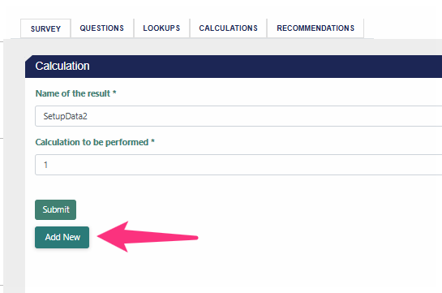
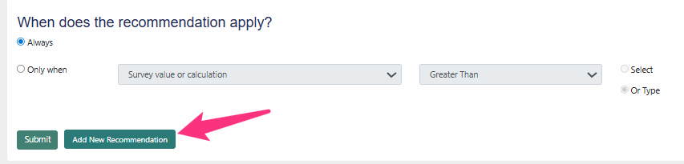
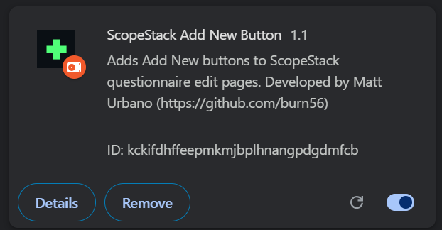

# ScopeStack Quality of Life Buttons

Chrome extension that adds shortcut buttons on ScopeStack questionnaire edit pages.

## Features

- Adds **Add New** button on calculation edit pages
- Adds **Add New Recommendation** button on recommendation edit pages

## Screenshots

### Add New Button (Calculations)

### Add New Recommendation Button

## Supported URLs

- `https://app.scopestack.io/admin/questionnaires/*/calculations/*/edit`
- `https://app.scopestack.io/admin/questionnaires/*/recommendations/*/edit`

## Install

1. Download or clone this repo
2. Open `chrome://extensions`
3. Enable **Developer mode**
4. Click **Load unpacked**
5. Select this folder

### Extension Installed

## Developed By

Matt Urbano  
https://github.com/burn56

